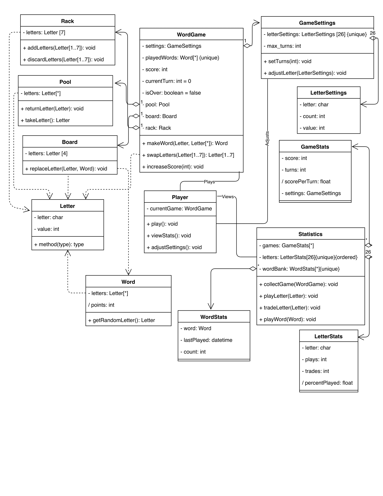
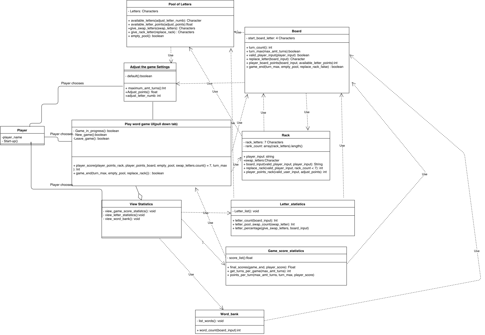
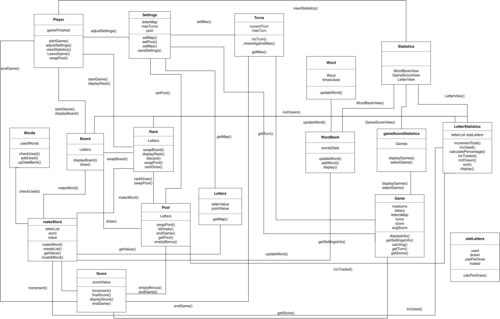
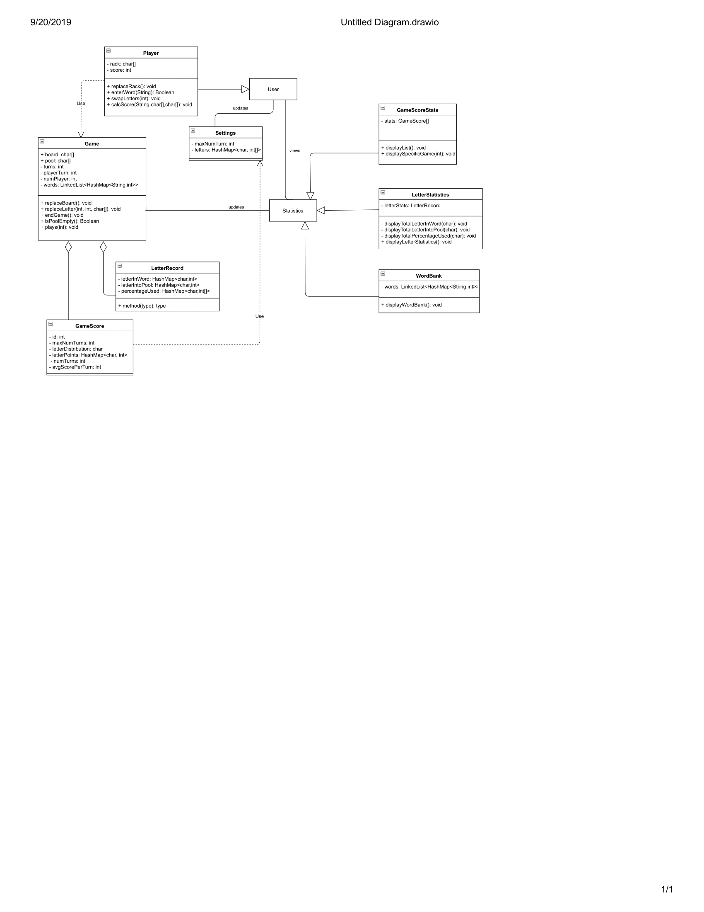

# Individual Designs

## Design 1

#### Design 1 Discussion

Potentially too much redundant composition and association. Otherwise pretty good!

## Design 2

#### Design 2 Discussion
Too many dependencies. Too much visual noise. Too many has or uses associations. UI design was not necessary. Not bad!

## Design 3

#### Design 3 Discussion
Cluttered. Needs types associated with properties and functions. Functions not clear. Turns, Rack, Board, Words, Letters, Pool, MakeWord, and score could have all potentially went inside of Game object which would create clarity and cut redundancy. Statistics has no properties.

## Design 4

#### Design 4 Discussion
User seems unnecessary. No functions to open settings or start the game anywhere in the UML. Statistics has no function represented to choose between GameScore, Letter, and WordBank. No UML representation for how statistics gets data from game or sends statistics to the individual statistics. Rack should be inside game. Pretty elegant.

# Team Design

## Commonalities
What things were the same?
Our game runs relatively independently of statistics and then updates statistics which then runs relatively independently of games. Most designs tend to have all game objects concentrated on one side, and all statistics objects are concentrated on the other with a narrow connection.

## Differences
What were the major differences?
Gabriel's has a large emphasis on using uses for associations, wheras Ben's is bloated with functions objects for association; Heejeong uses too little information to communicate the associations. Michael and HeeJeong erred on the side of a simpler design, wheras Ben and Gabriel did a little overexplaining.

## Decisions
Why did we choose the final design?
With minimal effort, we could make changes to Michael's design and have it meet all requirements in an elegant way.

# Summary
What did we learn?
- about designs
	- We learned that simplicity can make things easier to understand. 
	- It's not necessarily that it meets requirements better, but that it is easier to judge. 
	- If every object has an association with every object, the total associations is n*(n-1)/2. 
	- Each noun necessarily need an object. Sometimes making a noun a property of another object is better suited. 
	- Not every association needs to be called out. Only those necessary to explain functionality.
	- Functions in design should be simple and generalizable
- team work
	- It's challenging to coordinate schedules with multiple people who are involved in their careers.
	- It's also hard to find a form of communication that works for everyone.
	- Even though every one had difference experience levels, our diversity of experience provided different perspecives and ideas on design.
	- Having someone else look at your work can give important insight into some things one might have missed.
- etc
	- How to use the O' Rielly Library system.