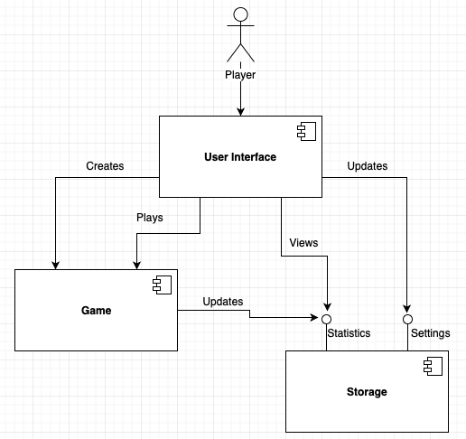
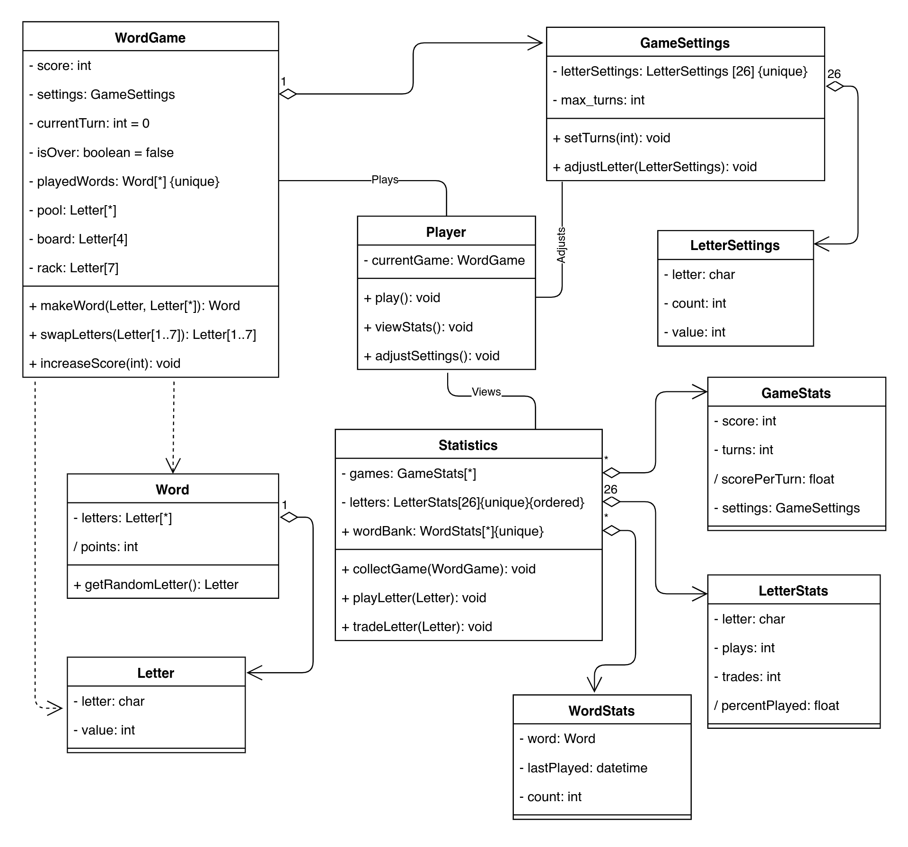
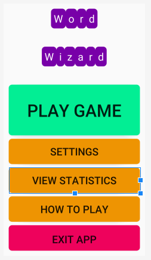
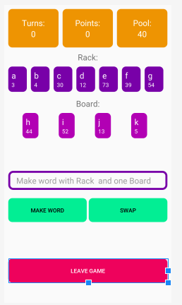

# Design Document

**Author**: Team28

## 1 Design Considerations

### 1.1 Assumptions

*Describe any assumption, background, or dependencies of the software, its use, the operational environment, or significant project issues.*

- It is assumed that the user of this software is familar with the word game Scrabble.
- It is assumed that the user of this software will have an Android compatible device
- It is further assumed that the Android device will be capable of running a currently supported version of Android
- It is assumed that the game must support multiple resolutions
- It is assumed that the layout of the screen will favor a veritcal orientation

### 1.2 Constraints

*Describe any constraints on the system that have a significant impact on the design of the system.*

- The hardware will have limited buttons, so all user input has to be captured via a touchscreen

### 1.3 System Environment

*Describe the hardware and software that the system must operate in and interact with.*

- The system should be designed to run on any currently supported Android Operating System version
- The hardware must be compatible with any currently supported Android Operating System
- The hardware must include a touchscreen display
- The combination of hardware and sofware must be capable of supporting at least 320x480 resolution
- The system requires an environment capbable of storing and recalling data that can be persisted while the system is not active

## 2 Architectural Design

*The architecture provides the high-level design view of a system and provides a basis for more detailed design work. These subsections describe the top-level components of the system you are building and their relationships.*

### 2.1 Component Diagram

### 2.2 Deployment Diagram

This is unnecessary as there is only a single single target to which the software will be deployed as a completely self contained system.

## 3 Low-Level Design

### 3.1 Class Diagram

### 3.2 Other Diagrams

*<u>Optionally</u>, you can decide to describe some dynamic aspects of your system using one or more behavioral diagrams, such as sequence and state diagrams.*

## 4 User Interface Design

### 4.1 Main Menu

### 4.2 Game Interface

