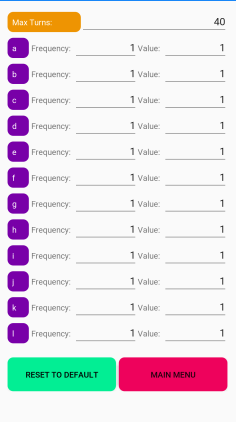
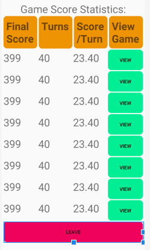

# Design Document

**Author**: Team_28

## 1 Design Considerations

### 1.1 Assumptions

- It is assumed that the user of this software is familar with the word game Scrabble.
- It is assumed that the user of this software will have an Android compatible device
- It is further assumed that the Android device will be capable of running a currently supported version of Android
- It is assumed that the game must support multiple resolutions
- It is assumed that the layout of the screen will favor a veritcal orientation

### 1.2 Constraints

- The hardware will have limited buttons, so all user input has to be captured via a touchscreen

### 1.3 System Environment

- The system should be designed to run on any currently supported Android Operating System version
- The hardware must be compatible with any currently supported Android Operating System
- The hardware must include a touchscreen display
- The combination of hardware and sofware must be capable of supporting at least 320x480 resolution
- The system requires an environment capbable of storing and recalling data that can be persisted while the system is not active

## 2 Architectural Design

### 2.1 Component Diagram

### 2.2 Deployment Diagram

This is unnecessary as there is only a single single target to which the software will be deployed as a completely self contained system.

## 3 Low-Level Design

### 3.1 Class Diagram

## 4 User Interface Design

### 4.1 Main Menu

### 4.2 Game Interface

### 4.3 Settings Screen

### 4.4 Statistics Screen

### 4.5 Letter Statistics Screen

### 4.6 Game Scores Screen

### UI Notes
Two Screens are not included in the UI documents. The "How To Play" Screen and the individual game statistics screen which is brought up after selecting a specific game in the Game Statistics screen
-The "How to Play" screen is not included because it will be a simple text screen without much UI work
-The individual game screen is not included because it will be the settings screen with all of the EditText Views Changed to TextViews