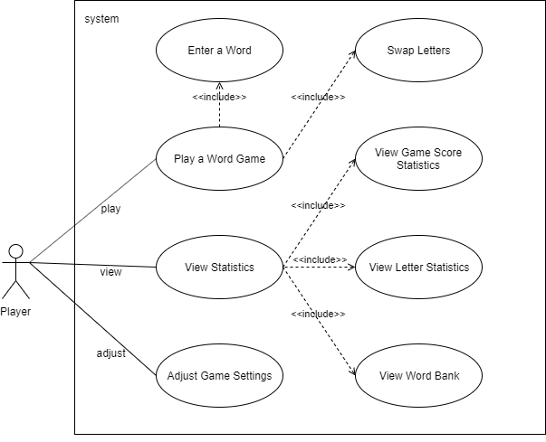

# Use Case Model

**Author**: Team_28

## 1 Use Case Diagram

## 2 Use Case Descriptions

### 2a Use Case Descriptions for "Play a Word Game"
| Use Case | Play a Word Game |
| ----------- | ---- |
| Requirements | This use case allows a Player to play a word game. |
| Pre-conditions | The Player clicks the 'Play' button in the main menu. |
| Exception | The system saves the current game status if the Player chooses to leave the game. |
| Scenarios | 1. This use case begins when the system switches to the play window. 2. The system displays a board and a rack. 3. The Player enters a word made up of one or more letters from the Player's rack, or chooses to swap letters from their rack with letters from the pool of letters, up to maximum number of turns. 4. The system terminates the use case when the maximum number of turns has been played or the pool or letters is empty and the rack cannot be filled.|
| Post-conditions | The system displays the final window, saves statistics of the game played, and then returns to the main menu. |

| Use Case | Enter a Word |
| ----------- | ---- |
| Requirements | This use case allows a Player to enter a word for the turn. |
| Pre-conditions | The Player enters a word in game. |
| Exception | The system rejects the word if the word entered is not valid. |
| Scenarios | 1. This use case begins when the Player enters a word made up of one or more letters from the Player's rack.  2. The system replaces the letter on the board by a different random letter from the word that was just played. 3. The system replaces the tiles used from the rack from the pool of letters. 4. The system calculates and updates the Player's score. 5. The system terminates the use case when the turn is finished.
| Post-conditions | The system waits for the Player's action for the next turn. |

| Use Case | Swap Letters|
| ----------- | ---- |
| Requirements | This use case allows a Player to swap 1-7 letters from their rack with letters from the pool of letters. |
| Pre-conditions | The Player chooses to swap letters in game. |
| Exception | The Player's rack or the pool of letters is empty. |
| Scenarios | 1. This use case begins when the Player chooses to swap letters. 2. The Player enters the number (1-7) of letters they wish to swap. 3. The indicated number of letters in the Player's rack are swapped with the letters from the pool. 4. This use case terminates when the swapping is finished.|
| Post-conditions | The system waits for the Player's action for the next turn. |

### 2b Use Case Descriptions for "View Statistics"
| Use Case | View Statistics |
| ----------- | ---- |
| Requirements | This use case allows a Player to view statistics of previously played games. |
| Pre-conditions | The Player clicks the 'View Statistics' button in the main menu. |
| Scenarios | 1. This use case begins when the system switches to the statistics window. 2. The Player chooses to view game score statistics, letter statistics, or the word bank. 3. This use case terminates when the user chooses to return to the main menu.|
| Post-conditions | The system returns to the main menu. |

| Use Case | View Game Score Statistics |
| ----------- | ---- |
| Requirements | This use case allows a Player to view game score statistics for previously played games. |
| Pre-conditions | The Player clicks the 'View Game Score' button in the statistics menu. |
| Scenarios | 1. This use case begins when the system switches to the game score statistics window. 2. The system displays the final game score, the number of turns in that game, and the average score per turn, in descending order by final score, for all games that were previously played. 3. The Player selects any of the game scores. 4. The system displays that game's maximum number of turns, letter distribution, and letter points. 5. The use case terminates when the Player chooses to return to the previous menu.|
| Post-conditions | The system returns to the View Statistics. |

| Use Case | View Letter Statistics |
| ----------- | ---- |
| Requirements | This use case allows a Player to view letter statistics for previously played games. |
| Pre-conditions | The Player clicks the 'View Letter Statistics' button in the statistics menu. |
| Scenarios | 1. This use case begins when the system switches to the letter statistics window. 2. The system displays the total number of times that letter has been played in a word, the total number of times that letter has been traded back into the pool, the percentage of times that the letter is used in a word out of the total number of times it has been drawn, in ascending order by number of times played for each letter. 3. The use case terminates when the Player chooses to return to the previous menu.|
| Post-conditions | The system returns to the View Statistics. |

| Use Case | View Word Bank |
| ----------- | ---- |
| Requirements | This use case allows a Player to view word bank for previously played games. |
| Pre-conditions | The Player clicks the 'View Word Bank' button in the statistics menu. |
| Scenarios | 1. This use case begins when the system switches to the word bank window. 2. The system displays all words that had been played and the number of times each word has been played, starting from the most recentply played word. 3. The use case terminates when the Player chooses to return to the previous menu.|
| Post-conditions | The system returns to the View Statistics. |

### 2c Use Case Descriptions for "Adjust Game Settings"
| Use Case | Adjust Game Settings |
| ----------- | ---- |
| Requirements | This use case allows a Player to adjust settings of the application. |
| Pre-conditions | The Player clicks the 'Adjust Settings' button in the main menu. |
| Exception | The application returns to the main menu without saving the settings if the Player chooses to leave without saving. |
| Scenarios | 1. This use case begins when the system switches to adjust game settings window. 2. The Player changes maxinum number of turns, letter points, and/or available letters in the pool. 3. This use case terminates when the Player chooses to return to the main menu. |
| Post-conditions | The system saves the settings and returns to the main menu. |
