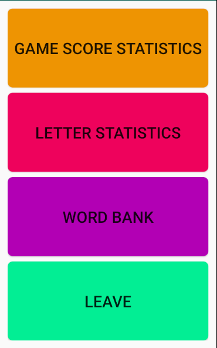

# User Manual

## Summary

Word Wizard is a Scrabble Practice app.  Players can focus on making words out of a rack and board.

## Main Screen

A Player stats the game with a pool of letters to draw from and a certain number of turns.  When the game begins 7 letters will be drawn from the pool and placed in the rack and four will be drawn and placed on the board.  A player then makes a turn

#### Turns

During a turn a player can take the following actions

1. Play A Word

2. Swap Letters

#### Ending the game

The game ends under the following scenarios

1. A Player runs out of turns

2. The Player uses all the available tiles

In the later scenario the user is awarded a 10 point bonus.

## Game Screen
This is the game screen.  

In the top row you have: 
- The total number of turns that have been played
- The total points you have accumulated this game so far
- The number of tiles remaining to be played

The next row represents the rack of letters you have to play with.  The point value of each letter is under each letter.

The next row represents the board.  This is similar to the rack of letters, but when forming a word, you must only use one of these letters.

The next row is a text input.  This is where you type in the letters you would like to use.  Under this input you have two buttons:
1. Make word will play the letters you have typed as a word
2. Swap will return your typed letters back to the pool in exchange for new onew.

At the bottom of the screen, you can choose to exit out of the game.

## Settings Screen

The Settings Screen allows you to alter the settings of the game.  You can change the total number of turns and the information about the letters.  For each letter you can assign how many go into the pool for each game, and how much each letter should be worth when played.

There is a button at the bottom of the screen to return to the main menu

## Stats

The Stats Screen allows you to navigate between detailed pages about certain statistics:
- Information about completed games
- Information about letters played
- Information about words played

There is a button at the bottom of the screen to return to the main menu

### Game Stats

The Game stats page keeps track of all finished games.  For each game you get to see the following:
- The Final Score
- The Number of turns used in the game
- The average score per turn
- The settings specific to that particular game

### Letter Stats

The Letter stats page gives specific details on every letter.  For each letter you can see how many times it has been drawn vs how many times it has been played in order to create a word.

### Word Stats

The Word stats page gives you a list of every word you've ever played, and how many times each word has been played.