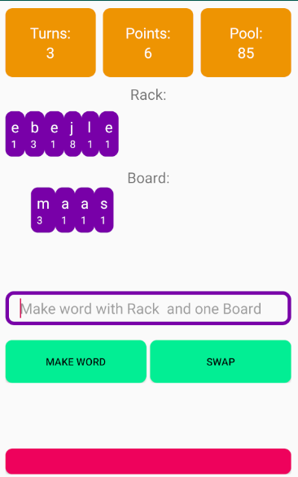

# User Manual

## Summary

Word Wizard is a Scrabble Practice app.  Players can focus on making words out of a rack and board.

## Main Screen

A Player stats the game with a pool of letters to draw from and a certain number of turns.  When the game begins 7 letters will be drawn from the pool and placed in the rack and four will be drawn and placed on the board.  A player then makes a turn

#### Turns

During a turn a player can take the following actions

1. Play A Word

2. Swap Letters

#### Ending the game

The game ends under the following scenarios

1. A Player runs out of turns

2. The Player uses all the available tiles

In the later scenario the user is awarded a 10 point bonus.

## Game Screen

## Settings Screen

## Stats

### Game Stats

### Letter Stats
